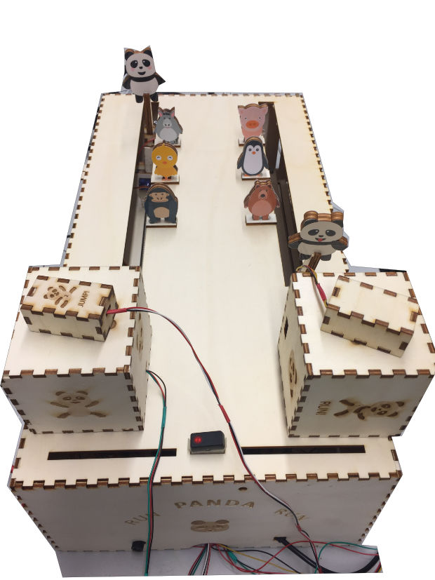
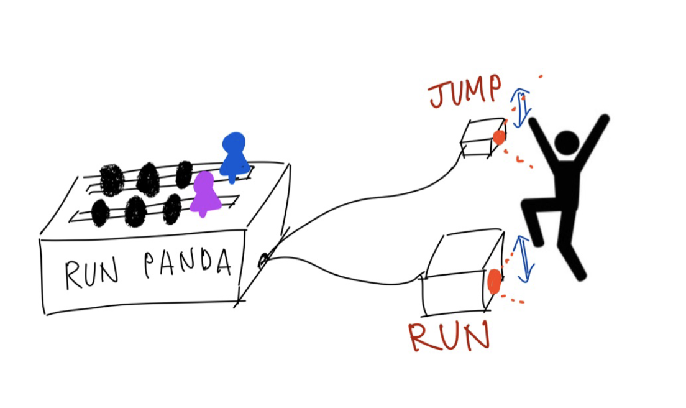
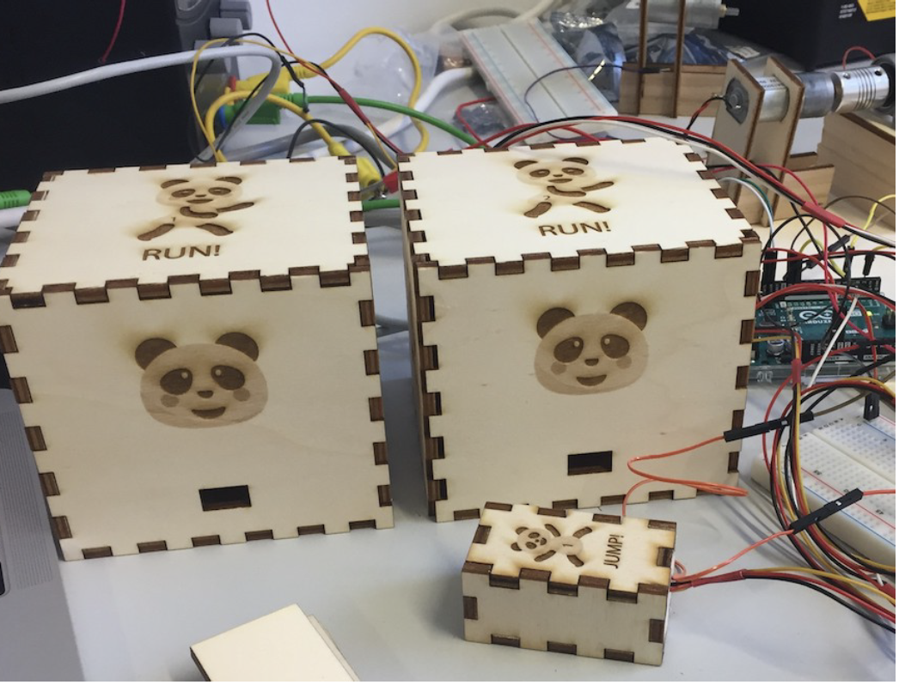
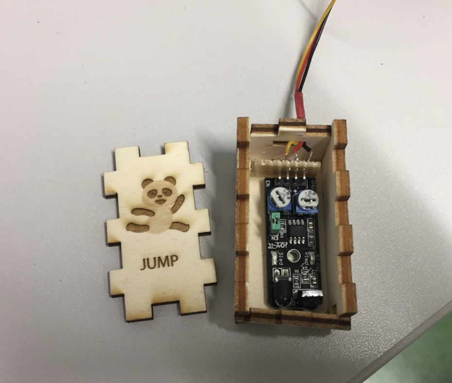
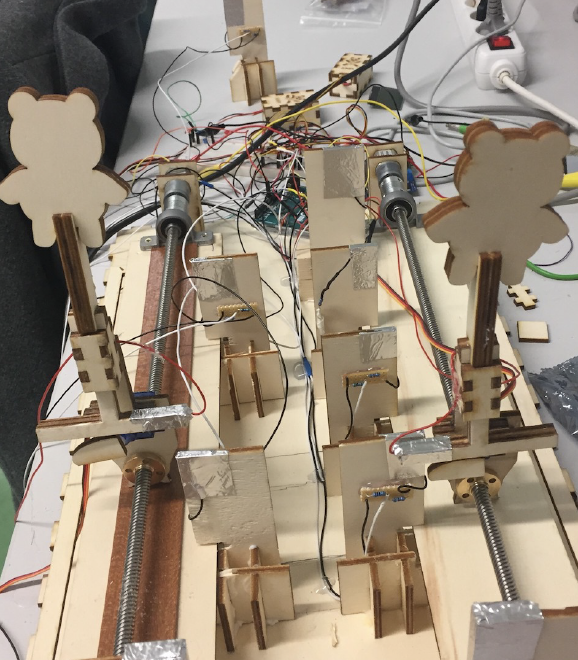
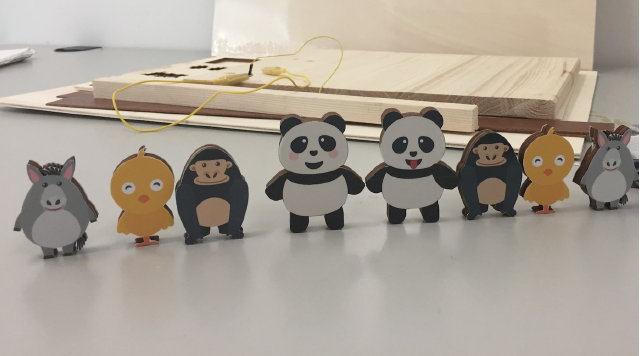
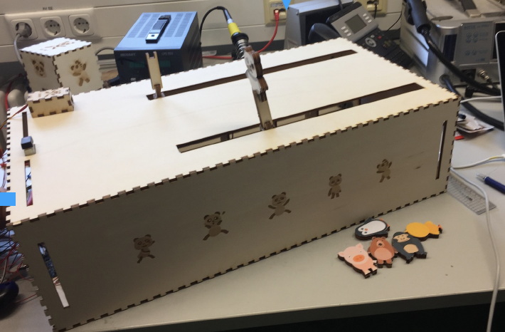
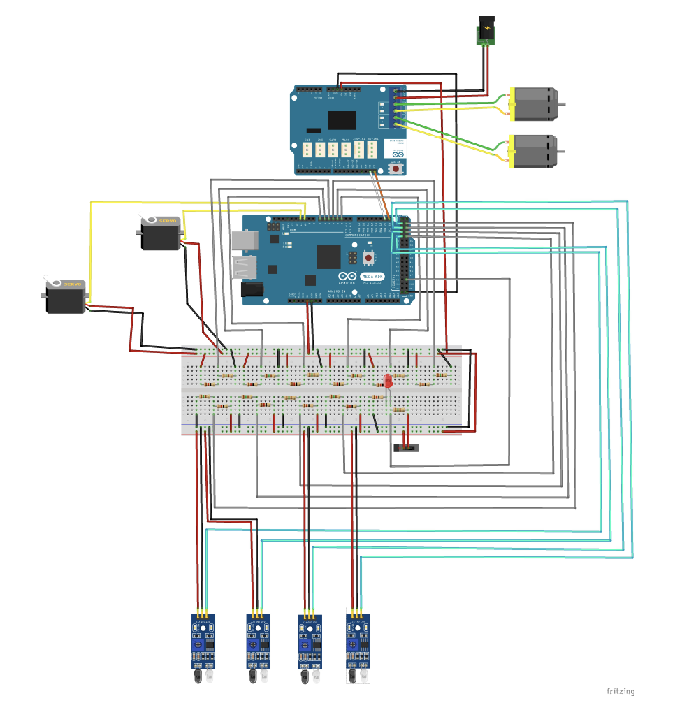

# :panda_face: Run Panda Run :panda_face: - Arduino Project 
 

## Project Title: RUN PANDA RUN
Ein interaktives **Jump'n'Run** Spiel mit **Hinderniserkennung-Sensor**

 

 
 
## Konzept
Unser Spiel ist ein interaktives und dynamisches Jump'n'Run Spiel für zwei Personen, welches
den Spieler auffordert sich selbst zu bewegen um so die Spielfigur zu bewegen. Die Spieler müssen sich
vor Controllern (einer für Springen und einer für Rennen) bewegen während diese Bewegungen von
Sensoren erkannt werden.

 

 

## Story
Zwei Panda konkurrieren miteinander um schneller ans Ziel zu kommen. Auf dem Weg zum Ziel stehen
einige Tiere (Hindernisse) und Spielfiguren müssen sie überspringen. Wenn sie gegen ein Hindernis
stoßen, werden sie um einige Schritte zurückgesetzt. Um das Spiel zu gewinnen, sollten sich die Spieler
möglichst schnell und korrekt vor den Controllern bewegen.
 

## Photos & Demo Video 
To see a demo video, click the screenshot. (:link::tv: **youtube link**)
<a style="float:right" href="https://www.youtube.com/watch?v=VFSfZBxCqsQ" target="_blank">

 
 
 
 
  

</a>
 

## Software

* #### Install Adafruit Motor Shield V2 library
To begin controlling motors, you will need to install the Adafruit_Motor_Shield_V2_Library library.
It is available from the Arduino library manager. From the IDE open up the library manager. 
And type in adafruit motor to locate the library. Click Install.
 
 

## Hardware
### Materialliste:
* Arduino MEGA
* Motorshield
* 2x Motoren
* 2x Servomotoren
* Gewindespindel
* 4x Hindernissensoren
* Schalter
* LED
* Widerstände 12 Ω, 150 Ω

### Verschaltungsdiagram

  

 

 

### Mehr Details zum Projekt
Sie können die PDF-Datei herunterladen, in der der Ablauf dieses Projekts erläutert wird.
[a link](https://github.com/parkhyerim/RunPandaRun-ArduinoProject/blob/master/Projekt.pdf)

